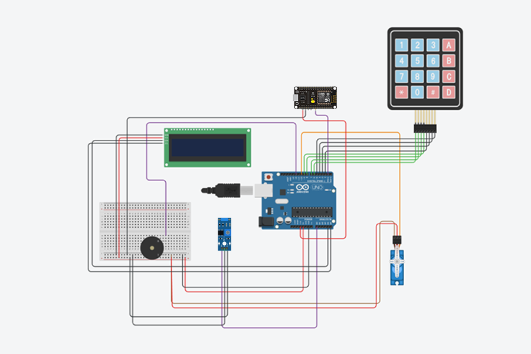

<h1>Sistem Keamanan Kotak Amal</h1>

sistem kemanan kotak amal berbasis IoT ini dibuat menggunakan microcontroller Arduino dan NodeMCU. Arduino berfungsi sebagai pusat kendali terhadap penguncian serta alarm dalam sistem. NodeMCU sebagai alat komunikasi dengan bot telegram sebagai notifikasi sistem

 

  

